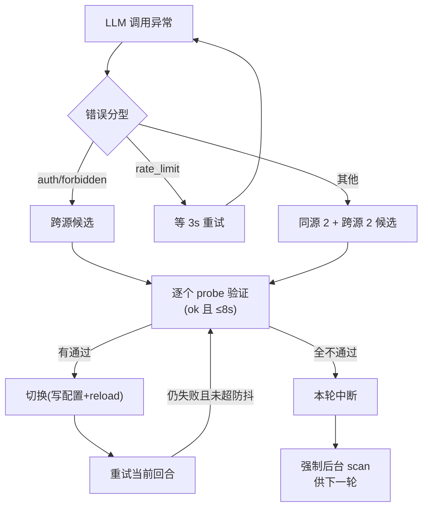

# AI 接入与渠道管理 · 设计文档

> 白绫 Agent 的 LLM 接入 / 渠道管理 / 容灾机制设计。本文档整理现有实现中已踩平的结构、逻辑链与坑，约束"独立 Go 网关"形态。
> 状态：v2.0（**Go 网关已完整落地**：`llm-gateway/` 独立进程，白绫对话已切换走网关 `/v1/chat`，渠道/key/容灾全部下沉网关）

---

## 1. 定位与目标

- **唯一职责**：把"模型对话"变成可靠的、可替换的服务——对外（白绫）只暴露 `chat / health / status / switch / scan`，内部负责渠道、健康、容灾、配置。
- **核心不变式**：`base_url` 与 `api_key` 永远匹配；用户手动配置的模型（锚点）恢复可用后自动回切；任何切换必须验证通过才生效。
- **当前形态**：Go 独立网关进程（`llm-gateway/bailing-gateway.exe`，仅 127.0.0.1 监听、单消费方无鉴权）；白绫 Python 侧退化为轻量 HTTP 客户端（`core/llm.py`），只消费 `/v1/chat` 结果，不再关心渠道 / key / 容灾。

---

## 2. 总体架构（v2.0 实际形态）

```mermaid
flowchart LR
    subgraph 白绫 Agent(Python)
        turn["任务循环 turn()"]
        client["LLMGateway 客户端<br/>(HTTP, 仅 /v1/chat)"]
        ui["WebUI /api/llm/*（管理面暂留 Python）"]
    end
    turn -->|chat 调用| client
    subgraph Go 网关进程(127.0.0.1:8766)
        proxy["/v1/chat 代理<br/>(手写 HTTP, 错误分型)"]
        failover["容灾: 候选+probe+切换"]
        health["健康表 llm_health.json"]
        cfg["配置 llm.json"]
    end
    client -->|POST /v1/chat| proxy
    proxy -->|/chat/completions| src1["月歌 api.yuegle.com"]
    proxy -->|/chat/completions| src2["DEEPSEEK api.deepseek.com"]
    failover -->|probe 并发| src1
    failover -->|probe 并发| src2
    cfg <-->|读写(原子)| health
    ui -->|config/switch/scan| cfg
```

**三层职责划分**

| 层 | 职责 | 不做的事 |
|---|---|---|
| 白绫 Agent | 任务编排、记忆、工具、情绪 | 不碰 llm.json / 健康表 / 渠道 / key / 容灾 |
| Go LLM 网关 | 对话代理、错误分型、容灾、健康扫描、配置管理、锚点回切、key 一致性 | 不感知任务内容 |
| 上游渠道 | 提供 OpenAI 兼容端点 | 无 |

---

## 3. 配置管理

### 3.1 配置来源与角色（三份文件，一份配置）

| 文件 | 角色 | 写入方 | 说明 |
|---|---|---|---|
| `config/llm.json` | **唯一配置源** | 网关（容灾/切换/扫描）+ Python 面板（过渡态：保存/切换） | 一切以它为准，两端热重载互读 |
| `config.yaml` 的 `llm:` 段 | **种子** | 无（只读） | 仅当 llm.json 缺失/损坏时初始化一次 |
| `config/llm_health.json` | **派生缓存** | 健康扫描 | 可随时重建，不算配置 |

规则：**删掉 llm.json = 恢复出厂**（从种子重建），之后所有读写只走 llm.json。

### 3.2 llm.json 结构

```jsonc
{
  "base_url": "https://api.yuegle.com",      // 当前生效地址
  "api_key": "sk-...",                        // 当前生效 Key（与 base_url 匹配）
  "model": "gemini-2.5-flash",                // 当前生效模型
  "temperature": 0.7,
  "max_tokens": 8192,                         // 0 非法：一律拒写
  "sources": [                                // 渠道源列表（多源）
    { "name": "月歌", "base_url": "https://api.yuegle.com",
      "api_key": "sk-...", "enabled": true, "models": ["gemini-2.5-flash", "..."] }
  ],
  "preferred_base_url": "https://api.yuegle.com",  // 锚点：用户手动选择的归属
  "preferred_model": "gemini-2.5-flash",
  "models_base_url": "https://api.yuegle.com",     // 模型列表属于哪个地址
  "models": ["gemini-2.5-flash", "..."],           // 全量模型列表（含不可用，仅展示）
  "models_updated_at": 0
}
```

### 3.3 一致性不变式（防错配，核心）

**`base_url` 与 `api_key` 必须来自同一渠道。** Key 解析顺序：

```
按当前 base_url 匹配 sources[key] → 顶层 api_key → 环境变量 BAILING_API_KEY
```

已有事故：顶层 api_key 曾残留为 DEEPSEEK 的 key，而 base_url 已是月歌 → 所有请求 401"无效令牌"。三层防御：

1. **读**：`_load_llm_cfg` 每次解析 key 都先按 base 匹配渠道（渠道 key 优先于顶层）；
2. **写**：`reload_llm` 中 base 变更时，若未显式传 key，自动按新 base 从渠道/环境变量解析，解析不到则沿用原值并返回 `warning`；
3. **自愈**：`_ensure_llm_key_consistency` 每轮/启动检查，发现顶层与渠道失配 → 修正并热重载。

### 3.4 写入与并发

- **原子写**：写临时文件 + `os.replace`，杜绝半写状态；
- **进程内锁**：`threading.RLock` 保护读写（扫描回写、容灾、UI 保存可能并发）；
- **热重载**：网关记录 `llm.json` mtime，每次 `/v1/chat` 入口检测，外部改动（Python 面板/前端/工具）自动 reload；Python 侧同样按 mtime 热重载——两端互读无冲突；
- **多实例风险**：进程内锁不跨进程。多 pythonw 并存时靠原子写保证文件不损坏，但可能丢失后写覆盖前写——部署上应保证单实例（启动前先杀旧进程）。

### 3.5 损坏与自愈

- JSON 解析失败 → 将坏文件改名备份（`.corrupt-<时间戳>`）→ 走种子初始化重建；
- 字段缺省 → 种子（config.yaml llm 段）补默认值。

### 3.6 渠道增删改（改名不丢配置）

- 保存渠道时按 **base_url 匹配旧记录**（不是按 name）：改名后 Key / 可用模型列表必须保留；
- 渠道 Key 留空 = 继承旧值（按 base 匹配）；再空则切源时拒绝并提示配置 Key 或设环境变量。

---

## 4. 渠道管理

### 4.1 渠道模型

一个渠道 = `name + base_url + api_key + enabled + models(可用列表)`。渠道可多个，任一时刻只有一个是"当前"。

### 4.2 手动切换（用户动作，锚点变更）

```
UI 选择渠道+模型
  → 后端 /admin/switch
  → 从渠道取 key（源 key → env）
  → probe 验证（目标模型必须 ok 且延迟 ≤8s）   ← 不通过直接拒绝，不写配置
  → reload_llm（写 llm.json：base_url+key+model）
  → set_llm_preferred（写 preferred_* = 本次选择）   ← 用户手动切 = 锚点
  → 回写健康表 record
  → 前端刷新「当前生效」显示
```

### 4.3 锚点与回切（用户权威）

- **语义**：配置面板填哪个模型，当前就是哪个模型；容灾切换只是**临时替换**；
- **回切条件**：锚点模型在健康表标记 ok → 自动切回；
- **防抖**：10 分钟内不重复尝试（防健康波动抖动）；
- **启动回锚**：boot 完成后立即检查一次（防上次容灾遗留临时模型）。

---

## 5. 健康扫描

### 5.1 probe 设计

- 直连 HTTP（不经 openai SDK，避免 SDK 对非标准响应崩掉）；
- URL 自动拼接：base 不以 `/v1` 结尾则补 `/v1`，再拼 `/chat/completions`；
- 请求体：`max_tokens=4`（最小化成本），超时 6s；
- 记录：`ok / latency / error 摘要`。

### 5.2 并发扫描与落盘

- 各源并发，源内模型并发 probe；
- 结果写入 `config/llm_health.json`（按 base_url 分键：`{model: {ok, latency, error, checked_at}}`）；
- 扫描完成后**回写各渠道 `models`（仅 ok 模型）**——前端渠道行下拉、候选列表都用它。

### 5.3 自动扫描

- 距上次 scan 超过 1 小时 → 主循环每轮头部触发**后台补扫**（不阻塞任务）；
- 防重入：`_scan_running` 标志；
- 容灾全候选失败 → 强制后台 scan（下一轮可用）。

---

## 6. 容灾机制（核心）

### 6.1 错误分型（错误码优先，子串兜底）

| 分型 | 判定 | 策略 |
|---|---|---|
| `auth / forbidden` | HTTP 401/403 | 密钥/权限问题：同源换模型无用 → **直接跨源** |
| `rate_limit` | HTTP 429 / "rate limit" | 限流：**等 3s 重试**，不切模型 |
| `model_missing` | 404 / "model not found" | 同源候选 → 跨源 |
| `unavailable` | 503 / "No available channel" | 同源候选 → 跨源 |
| `timeout` | 超时 / "timed out" | 同源候选 → 跨源 |
| `network` | 连接失败 / DNS | 同源候选 → 跨源 |
| `error` | 其他 | 同源候选 → 跨源 |

### 6.2 候选生成（同源 2 + 跨源 2）

- 同源：健康表当前 base 的 ok 模型（延迟升序），排除当前模型，取前 2；
- 跨源：其他启用渠道的 ok 模型，取前 2；
- **只允许健康表 ok 模型入候选**——坏模型（503）永远进不了候选。

### 6.3 切换前置验证（防切到坏模型）

候选逐个 **实时 probe**（ok 且延迟 ≤8s）才切换——健康表可能过期，必须以 probe 结果为准。

### 6.4 防抖与连续性（Go 实现参数）

- **冷却窗口**：30s 时间窗内最多 2 次容灾（`failoverWindow`/`failoverMax`）——单消费方防死循环；窗口过期自动重置；
- **切换前置**：候选逐个实时 probe（ok 且延迟 ≤8s）才切换；probe 超时 6s、chat 超时 60s；
- 切换成功 → **重试当前请求**（不中断对话）；
- 切换失败（候选全挂）→ 返回明确错误码 + 触发后台扫描供下一轮；
- **回锚防抖**：10 分钟内不重复尝试回切（`revertPreferred`），且仅同源回切（锚点源 ≠ 当前源时不跨源回切）；
- **入口自愈**：每次 `/v1/chat` 先热重载（外部改 llm.json 即生效）→ key 一致性自愈 → 回锚检查 → 正常调用。曾踩坑（Python 侧）：`_failover_used` 只置 True 从不重置，导致历史容灾后永久跳过容灾、一错就断——Go 改为时间窗制从根上规避。

### 6.5 完整容灾流程



---

## 7. 逻辑链（关键路径，v2.0 Go 网关形态）

### 7.1 对话调用链

```
用户输入 → 白绫 turn() → LLMGateway.chat()（HTTP POST 网关 /v1/chat）
  网关入口：热重载(外部改配置) → key 一致性自愈 → 回锚检查
  → chatOnce 调用当前 base/key/model
  → 成功？→ 解析 content/tool_calls → 返回白绫
  → 失败？→ ErrClass 分型 → 冷却窗内? → 候选生成(同源2+跨源2, 坏模型排除)
       → 逐个 probe 验证(ok 且 ≤8s) → 切换(写配置+锚点不动) → 重试当前请求
       → 全失败 → 明确错误 + 触发后台 scan
  → 白绫拿到 content / failover_note（感知切换）→ 工具调用循环 → 回复
```

### 7.2 启动链

```
启动.bat / server.py main → ensure_gateway_up()（网关不在→CREATE_NO_WINDOW 拉起→轮询 /health≤7s）
网关 boot → 读 llm.json（缺失/损坏→.corrupt 备份+种子）→ key 一致性自愈 → 热重载就绪
白绫 boot → 读 llm.json → 构造 LLMGateway(HTTP 客户端) → /api/status ready:true
```

### 7.3 配置保存链（当前过渡态：Python 面板 → 网关热重载）

```
saveCfg → Python /api/config（校验：坏模型拒绝 / max_tokens≤0 不覆盖 / key 空按 base 解析）
  → 写 llm.json（原子）→ set_llm_preferred（锚点）
  → 网关下次 /v1/chat 热重载生效；Python 面板返回真实当前状态
网关 /admin/config 为同能力实现（前端切 base 后直接复用）
```

### 7.4 显示真实性链

```
/api/config 视图 = 当前生效(base/model) + failover 标志 + preferred(锚点)
  failover = (当前 model ≠ 锚点 model)   ← 容灾切换后立即真实反映
前端「当前生效」行：
  正常：当前生效：月歌 / gemini-2.5-flash
  容灾中：当前生效：月歌 / gemini-3.1-pro-preview（容灾临时切换，锚点 gemini-2.5-flash 恢复可用自动切回）
```

---

## 8. 错误处理细节（踩坑记录，Python + Go 双段）

### 8.1 Python 侧（老实现已踩平）

| # | 坑 | 现象 | 对策 |
|---|---|---|---|
| 1 | openai SDK 对非标准错误响应崩 | `AttributeError: 'str' object has no attribute 'choices'` | 不用 SDK 解析错误：沿异常链还原 `status_code + response`；Go 手写 HTTP 天然规避 |
| 2 | base_url 不带 `/v1` | SDK 打到根路径返回 HTML → 解析崩 | 统一规范化：不以 `/v1` 结尾补 `/v1` |
| 3 | OneAPI 503"无渠道" | `No available channel for model ... under group vip` | 分型 unavailable → 换模型/换源；列表里"计入的模型"≠"可用模型" |
| 4 | key 与 base 错配 | 401 无效令牌 | 见 3.3 一致性不变式 |
| 5 | max_tokens=0 | LLM 请求必挂 | 前端空/0 不提交；后端 ≤0 不覆盖 |
| 6 | 容灾防抖永不重置 | 一次容灾后永久不再容灾 | 每轮 turn 重置（Go 改为 30s 时间窗制） |
| 7 | 渠道改名丢 key/models | 按 name 匹配旧值 | 按 base_url 匹配 |
| 8 | probe 拼 URL 漏 /v1 | 打根路径 HTML/JSONDecodeError | probe 与客户端共用同一 URL 规范化 |

### 8.2 Go 网关实现期新踩坑（已修）

| # | 坑 | 现象 | 对策 |
|---|---|---|---|
| 9 | Go 严格类型解析 Python 遗留 JSON | `models_updated_at` 为**字符串** → Go int64 解析失败 → 误判 llm.json"损坏"，备份重建种子，配置丢 | 时间/可空字段一律 `any` 宽容类型（models_updated_at、_updated_at、checked_at、tested_at 等） |
| 10 | 健康表 JSON 结构与 Python 不一致 | Python 侧是**顶层按 base_url 分键**（无 `sources` 包装），Go 用嵌套结构 → Sources 全空、usable/bad 全 null | 自定义 `UnmarshalJSON/MarshalJSON`：顶层 `{base_url: {models: {...}}, "_updated_at": ...}` |
| 11 | tool_calls 嵌套结构未扁平化 | openai 返回 `{id, function:{name, arguments}}`，Go 原样透传 → 白绫拿到 `name=""` | 扁平化为 `{id, name, arguments}`（白绫原有格式） |
| 12 | 路由重复注册 panic | `/api/config` 注册两次 → `panic: pattern conflicts` | 合并为 METHOD 分发（一个 handler 内 GET/POST 分支） |
| 13 | 无热重载 | 外部改 llm.json → 网关内存不变 → 配置不生效 | mtime 检测 `ReloadIfChanged()`，每次 `/v1/chat` 入口调用 |
| 14 | 损坏文件判定过激 | 仅类型不匹配（未坏）也备份重建 | 宽容类型优先；真 JSON 语法错误才走 `.corrupt-<ts>` 备份+种子 |

---

## 9. API 面（已落地）

### 9.1 Go 网关 `llm-gateway/`（127.0.0.1:8766，唯一对话通道）

**白绫面**（`core/llm.py` 只消费这一个）：

| 方法 | 路径 | 用途 | 请求 | 响应 |
|---|---|---|---|---|
| POST | `/v1/chat` | 对话代理（含容灾） | `{messages, tools?, tool_choice?, temperature, max_tokens}` | `{content, reasoning_content, tool_calls[{id,name,arguments}], finish_reason, model, base_url, failover_note, failover_applied, error?, error_code?}` |
| GET | `/health` | 网关探活（就绪/自动拉起探测） | - | `{ok, ready}` |

**管理面**（与前端现有路径对齐，双路径注册）：

| 方法 | 路径 | 用途 |
|---|---|---|
| GET/POST | `/admin/config` = `/api/config` | 读/写 LLM 配置（坏模型拒绝、max_tokens≤0 不覆盖、key 空按 base 解析、保存即设锚点） |
| POST | `/admin/test` = `/api/config/test` | 直连 probe 测连接（latency/model/error） |
| GET | `/admin/models` = `/api/models` | 模型列表 + `usable` / `bad` 分型 |
| POST | `/admin/models/fetch` = `/api/models/fetch` | 拉取端点模型列表 |
| GET | `/admin/health` = `/api/llm/health` | 健康表 |
| POST | `/admin/scan` = `/api/llm/scan` | 全渠道并发健康扫描（源并发+模型并发） |
| POST | `/admin/switch` = `/api/llm/switch` | 手动切渠道（probe 验证通过才生效 + 设锚点） |
| GET/POST | `/admin/sources` = `/api/llm/sources` | 渠道列表 / 保存（按 base 匹配旧值，key 打码） |

### 9.2 白绫侧改造（`core/llm.py`，已完成）

- `LLMGateway` 保留原构造与 `chat()` 返回格式（`agent.py` 零改动），内部改为 stdlib HTTP 调用网关 `/v1/chat`；
- **不再使用 openai SDK**（根除踩坑 #1/#2）；
- **自动拉起**：网关不可达 → 尝试 `CREATE_NO_WINDOW` 拉起 exe → 轮询 `/health` ≤7s → 仍失败返回明确错误（"LLM 网关不可达…"）；
- 网关地址/ exe / 配置目录可用环境变量覆盖：`BAILING_GATEWAY_URL` / `BAILING_GATEWAY_EXE` / `BAILING_GATEWAY_CONFIG`，默认推断 self-agent 布局；
- 网关返回 `error/error_code` 透传；`model/base_url/failover_note/failover_applied` 一并返回（白绫可感知"刚才切换了模型"）。

### 9.3 管理面归属现状（过渡态）

- **对话**已 100% 走网关；**配置面板管理 API 暂时仍由 Python 8765 响应**（前端未切 base）；
- 两进程共用 `config/llm.json`：网关 mtime 热重载 + Python 既有热重载，互读无冲突（Python 面板改配置 → 网关下轮生效；网关容灾切换 → Python 面板显示真实当前值）；

---

## 10. 安全与边界

- **Key 泄露防护**：UI 一律打码；日志不落明文；外部 Key 走环境变量 `BAILING_API_KEY`；
- **写入白名单**：网关仅本机监听（127.0.0.1），单消费方无鉴权（只为白绫服务，不存在其他消费方）；
- **单实例约束**：部署保证单一网关进程；白绫侧自动拉起用 `CREATE_NO_WINDOW`，不会重复起多份（端口占用即失败）；
- **坏配置隔离**：任何校验失败（坏模型/空 Key/非法参数）都**拒绝写入**，不产生半生效状态；
- **启动绑定**：`启动.bat` 先静默拉起网关再启白绫；`webui/server.py` 的 `main()` 同样兜底 `ensure_gateway_up()`——无论哪种方式启动白绫，网关都跟着起。

---

## 11. 部署与运维

**目录结构**

```
llm-gateway/
  main.go          # 入口（--port/--config、双路径注册）
  config.go        # ConfigStore：原子写、mtime 热重载、KeyFor/ResolveKey/EnsureKeyConsistency
  health.go        # HealthStore：顶层分键 JSON 兼容、Probe、ScanAll、UsableBad
  proxy.go         # /v1/chat 手写 HTTP 代理、ErrClass 分型、parseChatResp（tool_calls 扁平化）
  failover.go      # 候选(同源2+跨源2)、probe 验证、30s 冷却窗、回锚 10min 防抖
  api.go           # 全部 handler（双路径 /admin/* + /api/*）
  util.go          # os/io 别名、时间戳
  bailing-gateway.exe      # 构建产物
  start-gateway-hidden.vbs # 双击静默启动（相对路径定位，可随目录迁移）
```

**启动/停止**

```
# 启动（隐藏窗口，任选其一）
启动.bat                              # 推荐：网关 + 白绫一起起
wscript llm-gateway\start-gateway-hidden.vbs   # 仅网关
bailing-gateway.exe --config F:\me\self-agent\config --port 8766

# 停止
Stop-Process -Name bailing-gateway   # 网关
# 白绫退出后网关无状态可留；白绫下次启动自动复用/拉起
```

**验证命令**

```
GET http://127.0.0.1:8766/health            # 网关就绪
GET http://127.0.0.1:8766/api/config        # 配置 + 真实当前(base/model/failover/锚点)
POST /api/llm/scan                          # 并发健康扫描
POST /api/llm/switch {source_name, model}   # 手动切渠道（probe 验证）
POST /v1/chat {messages:[...]}              # 对话代理（含容灾）
```

**回归测试脚本**（`llm-gateway/_test_*.py`，全链路已通过）

| 脚本 | 覆盖 |
|---|---|
| `_test_e2e.py` | 探活/配置/scan/chat/switch/坏模型拒绝 |
| `_test_failover.py` | 热重载 + 回锚（坏模型自动恢复锚点） |
| `_test_real_failover.py` | 真容灾（锚点变坏 → 自动切换 + failover 真实状态） |
| `_test_client.py` | 白绫客户端：正常对话 / 自动拉起(6s) / 容灾透传 |
| `_test_tools.py` | 工具调用 tool_calls 格式透传 |

---

## 12. 演进待办

- [x] Go 网关骨架：配置读取 + chat 代理 + 容灾 + scan/switch API（配置兼容现有 json）
- [x] 白绫侧 HTTP client 替换（`core/llm.py` 走网关 `/v1/chat`）+ 端到端回归（坏模型自动切 / 回锚 / 并发扫描 / 工具调用）
- [x] 无状态化容灾冷却定稿（30s 时间窗最多 2 次）
- [x] 启动绑定（启动.bat + server.py 兜底 + 自动拉起）
- [ ] **前端 LLM 管理面板切到网关 8766**（面板显示 failover 真实状态；切后 Python 管理 API 可下线）
- [ ] Python `llm` 管理模块下线（agent.py 中 config/scan/switch 相关代码清理，保留对话编排）
- [ ] 网关自身崩溃检测与白绫告警（超时 + 重试 + 状态上报，部分已由自动拉起覆盖）
- [ ] 网关进程守护（异常退出自动重启，当前依赖白绫对话时拉起）
