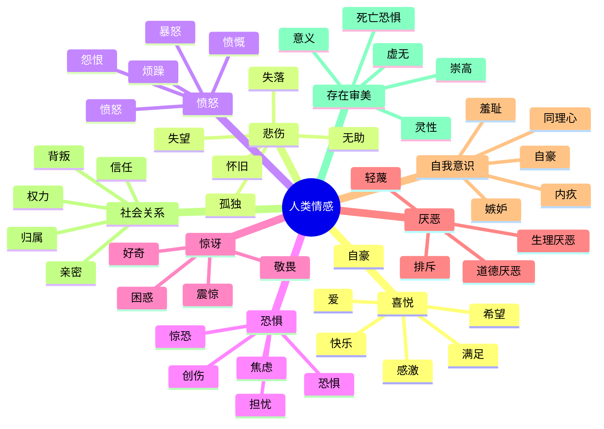

# 🌳 人类情感树 Markdown 模型

> 说明：这是一个启发性、可扩展的情感分类树，不是心理诊断系统。  
> 情绪通常以混合、流动、强度变化的方式出现。  
> 标签：`[基本]` `[复合]` `[自我意识]` `[社会]` `[存在]` `[审美]` `[认知]`

## 0. 根节点：情感

### 0.1 六维坐标

| 维度 | 低 | 中 | 高 | 备注 |
|---|---|---|---|---|
| 效价 | 负 | 混合 | 正 | 可同时正负 |
| 唤醒 | 平静 | 激活 | 亢奋 | 决定能量 |
| 时间 | 过去 | 当下 | 未来 | 怀旧 / 焦虑 |
| 对象 | 自我 | 他人 | 群体 / 世界 | 决定社会性 |
| 控制感 | 无力 | 部分 | 掌控 | 影响应对 |
| 社会性 | 私人 | 关系 | 文化 | 影响表达规则 |

### 0.2 树例标签

- `[基本]` 跨文化较普遍
- `[复合]` 由多种情绪混合
- `[自我意识]` 需要自我评价
- `[社会]` 需要他人 / 群体
- `[存在]` 涉及意义、死亡、自由、孤独
- `[审美]` 涉及美、崇高、创造
- `+` 表示混合配方
- `→` 表示常见演化路径

---

## 1. 一级分支：基本情绪

### 1.1 喜悦 / 正性激活

- 满足 `[基本]`
  - 平静
  - 安心
  - 知足
  - 释然
- 快乐 `[基本]`
  - 愉悦
  - 兴奋
  - 欢欣
  - 狂喜
- 爱 / 联结 `[基本/社会]`
  - 温情
  - 亲密
  - 依恋
  - 慈悲
  - 博爱
- 自豪 `[自我意识]`
  - 成就自豪
  - 道德自豪
  - 集体自豪
- 感激 `[社会]`
  - 欣赏
  - 感恩
  - 谦卑感激
- 希望 `[认知/未来]`
  - 乐观
  - 期待
  - 信念
  - 憧憬

### 1.2 悲伤 / 失去

- 失落 `[基本]`
  - 难过
  - 心痛
  - 哀悼
  - 绝望
- 孤独 `[社会/存在]`
  - 社交孤独
  - 情感孤独
  - 存在孤独
- 失望 `[认知]`
  - 沮丧
  - 气馁
  - 幻灭
- 怀旧 `[复合]`
  - 甜蜜忧伤
  - 苦涩怀念
  - 乡愁
- 无助 `[存在]`
  - 无力
  - 被抛弃
  - 屈服
  - 虚无

### 1.3 愤怒 / 边界

- 烦躁 `[低强度]`
- 恼怒
- 愤怒 `[基本]`
- 暴怒 `[高强度]`
- 愤慨 `[道德]`
  - 道德愤怒
  - 正义愤怒
- 怨恨 `[慢性]`
- 敌意 `[关系]`
- 挫折 `[目标受阻]`

### 1.4 恐惧 / 威胁

- 不安 `[低强度]`
- 担忧 `[认知]`
- 焦虑 `[未来]`
  - 广泛性焦虑
  - 社交焦虑
  - 分离焦虑
  - 存在焦虑
- 恐惧 `[基本]`
  - 惊恐
  - 恐惧症
  - 创伤反应
- 偏执 `[社会]`
- 冻结 `[防御]`

### 1.5 惊讶 / 注意

- 好奇 `[认知]`
- 困惑 `[认知]`
- 震惊 `[高强度]`
- 惊愕
- 敬畏 `[复合/审美]`
- 醒悟 `[认知转变]`

### 1.6 厌恶 / 排斥

- 生理厌恶 `[基本]`
- 道德厌恶 `[社会]`
- 反感
- 轻蔑 `[等级]`
- 鄙视
- 排斥 `[社会]`

---

## 2. 二级分支：自我意识情绪

### 2.1 羞耻

- 尴尬
- 羞怯
- 羞辱
- 丢脸
- 自我厌恶
- 羞耻-愤怒螺旋

### 2.2 内疚

- 悔恨
- 自责
- 道德痛苦
- 补偿冲动
- 修复失败

### 2.3 嫉妒 / 羡慕

- 羡慕：`渴望 + 自卑 + 悲伤`
- 妒忌：`爱 + 恐惧失去 + 愤怒 + 比较`
- 占有欲
- 竞争性比较

### 2.4 同理心

- 认知共情
- 情感共情
- 共情痛苦
- 同情
- 慈悲
- 共情喜悦

### 2.5 自豪

- 真实自豪
- 自大 / 防御性自豪
- 集体自豪
- 道德自豪

---

## 3. 三级分支：社会 / 关系情绪

- 归属 / 接纳
- 排斥 / 拒绝
- 信任
- 背叛
- 忠诚
- 叛离
- 权力感
- 无力感
- 荣誉
- 羞辱
- 竞争
- 合作
- 亲密
- 疏离
- 照顾
- 被照顾
- 支配
- 服从

---

## 4. 四级分支：存在 / 审美 / 认知情绪

- 好奇
- 困惑
- 敬畏
- 崇高
- 神秘
- 意义感
- 虚无感
- 存在焦虑
- 死亡恐惧
- 灵性狂喜
- 顿悟
- 荒谬感
- 时间焦虑
- 自由焦虑
- 责任重负
- 审美愉悦
- 创造狂喜
- 心流

---

## 5. 复合情绪配方表

| 复合情绪 | 配方 | 典型触发 | 行动倾向 | 风险 / 资源 |
|---|---|---|---|---|
| 爱恨交织 | 爱+愤怒+依恋+恐惧 | 亲密关系冲突 | 拉扯 / 控制 / 修复 | 风险：虐待循环；资源：边界与沟通 |
| 悲喜交加 | 悲伤+喜悦+怀旧 | 毕业、婚礼、离别 | 流泪与微笑 | 资源：整合丧失与成长 |
| 嫉妒 | 爱+恐惧失去+愤怒+羞耻 | 第三者威胁 | 监控 / 质问 / 竞争 | 风险：控制；资源：安全感 |
| 内疚 | 悲伤+恐惧+自我愤怒+共情 | 伤害他人 | 道歉 / 补偿 / 回避 | 资源：道德修复 |
| 敬畏 | 恐惧+惊讶+钦佩+渺小 | 星空、自然、伟大 | 静默 / 臣服 / 探索 | 资源：超越自我 |
| 怀旧 | 悲伤+喜悦+渴望+安全 | 旧歌、老照片 | 回忆 / 分享 / 返乡 | 风险：理想化过去 |
| 希望 | 喜悦+期待+恐惧+信念 | 不确定但可能变好 | 坚持 / 计划 / 求助 | 资源：韧性 |
| 绝望 | 悲伤+恐惧+无力+意义丧失 | 长期失败 / 丧失 | 放弃 / 封闭 | 风险：抑郁；资源：支持 |
| 愤世嫉俗 | 愤怒+厌恶+失望+防御 | 反复被背叛 | 嘲讽 / 疏离 | 风险：孤立 |
| 尴尬 | 羞耻+惊讶+焦虑+社交暴露 | 当众出错 | 掩饰 / 道歉 / 逃离 | 资源：自嘲与修复 |
| 羡慕 | 渴望+自卑+悲伤+敌意 | 他人优势 | 比较 / 贬低 / 模仿 | 资源：榜样 |
| 同情 | 悲伤+爱+关心+认知共情 | 他人受苦 | 帮助 / 安慰 | 风险：耗竭 |
| 幸灾乐祸 | 喜悦+轻蔑+敌意+比较 | 对手失败 | 嘲笑 / 庆祝 | 风险：关系破坏 |
| 感激 | 喜悦+爱+谦卑+互惠 | 被帮助 | 回报 / 分享 | 资源：联结 |
| 宽恕 | 愤怒+慈悲+放下+时间 | 被伤害后 | 释放 / 重建 / 设界 | 不是遗忘 |
| 复仇 | 愤怒+恨+计划+正义感 | 不公 | 惩罚 / 攻击 | 风险：循环 |
| 浪漫爱 | 爱+性欲+依恋+希望+恐惧 | 吸引 | 接近 / 承诺 / 理想化 | 风险：痴迷 |
| 孤独 | 悲伤+渴望+被抛弃恐惧+疏离 | 缺乏共鸣 | 寻找 / 封闭 | 资源：主动连接 |
| 无聊 | 低唤醒+厌恶+意义缺失 | 重复 / 无挑战 | 寻求刺激 | 风险：成瘾 |
| 心流 | 专注+喜悦+挑战+掌控 | 技能匹配任务 | 沉浸 / 创造 | 资源：意义 |

---

## 6. 强度梯度

| 家族 | 低 | 中 | 高 | 极强 |
|---|---|---|---|---|
| 喜悦 | 满足 | 快乐 | 兴奋 | 狂喜 |
| 悲伤 | 失落 | 难过 | 悲痛 | 绝望 |
| 愤怒 | 烦躁 | 恼怒 | 愤怒 | 暴怒 |
| 恐惧 | 不安 | 担忧 | 恐惧 | 惊恐 |
| 羞耻 | 尴尬 | 羞耻 | 羞辱 | 自我崩溃 |
| 爱 | 好感 | 喜欢 | 爱 | 痴迷 / 奉献 |
| 厌恶 | 不适 | 反感 | 厌恶 | 排斥 |
| 孤独 | 独处 | 寂寞 | 孤独 | 存在性孤立 |

---

## 7. 对象矩阵

| 情绪 / 对象 | 自我 | 他人 | 群体 | 过去 | 未来 | 世界 / 存在 |
|---|---|---|---|---|---|---|
| 愤怒 | 自我愤怒 | 对他怒 | 群体愤怒 | 对旧事怒 | 对阻碍怒 | 对命运怒 |
| 恐惧 | 自我怀疑 | 社交恐惧 | 群体恐慌 | 创伤 | 预期焦虑 | 存在恐惧 |
| 悲伤 | 自怜 | 离别 | 集体哀悼 | 怀旧 | 预期丧失 | 虚无 |
| 羞耻 | 自我羞耻 | 公开羞耻 | 集体羞耻 | 旧耻 | 怕丢脸 | 存在羞耻 |
| 爱 | 自爱 | 亲情 / 友情 / 浪漫 | 博爱 | 怀念 | 承诺 | 对自然 / 神 |
| 喜悦 | 自我满足 | 关系喜悦 | 集体欢庆 | 感激回忆 | 希望 | 审美狂喜 |
| 厌恶 | 自我厌恶 | 反感 | 群体排斥 | 旧恶 | 预期厌恶 | 道德厌恶 |
| 孤独 | 自我疏离 | 关系孤独 | 社会孤立 | 失去联结 | 怕永远孤独 | 存在孤独 |

---

## 8. 情绪生命周期

1. **触发**：事件、记忆、身体状态、社会线索。
2. **评价**：威胁？丧失？不公？暴露？意义？
3. **生理**：心跳、呼吸、肌肉、温度、肠胃。
4. **感受**：效价、唤醒、强度 0-10。
5. **冲动**：趋近、回避、攻击、冻结、求助、修复。
6. **表达**：面部、声音、姿态、语言、行动。
7. **后果**：关系、身体、自我认同、环境。
8. **调节**：命名、呼吸、认知重评、求助、边界、创造。
9. **修复**：道歉、补偿、宽恕、重建、意义重构。
10. **学习**：记忆、图式、依恋、文化脚本。

---

## 9. 交叉连接 / 情感网络

- 爱 ↔ 恐惧 = 依恋焦虑 / 占有
- 愤怒 ↔ 悲伤 = 抑郁性愤怒 / 无力感
- 羞耻 ↔ 愤怒 = 羞耻-愤怒螺旋
- 内疚 ↔ 共情 = 道德修复
- 恐惧 ↔ 好奇 = 敬畏 / 冒险
- 喜悦 ↔ 悲伤 = 怀旧 / 悲喜交加
- 厌恶 ↔ 道德 = 道德厌恶 / 排斥
- 孤独 ↔ 爱 = 渴望联结 / 依赖
- 权力 ↔ 恐惧 = 控制 / 压迫
- 意义 ↔ 虚无 = 存在振荡
- 嫉妒 ↔ 爱 = 竞争 / 保护
- 希望 ↔ 绝望 = 韧性 / 崩溃边缘

---

## 10. 常见情绪路径示例

- **被背叛**：信任 → 惊讶 → 悲伤 → 愤怒 → 怨恨 → 宽恕 / 断绝 / 复仇
- **公开失败**：惊讶 → 羞耻 → 恐惧 → 自责 → 回避 / 修复
- **收到赞美**：惊讶 → 喜悦 → 自豪 → 感激 → 亲密
- **长期孤独**：悲伤 → 渴望 → 恐惧 → 自我否定 → 封闭 / 主动连接
- **面对不公**：愤怒 → 道德愤慨 → 希望 → 行动 / 愤世嫉俗
- **失去亲人**：震惊 → 悲伤 → 内疚 → 怀旧 → 意义重构

---

## 11. 情绪节点模板

```markdown
### 情绪名称
- 别名：
- 类型：基本 / 复合 / 自我意识 / 社会 / 存在 / 审美
- 效价：负 / 混合 / 正
- 唤醒：低 / 中 / 高
- 时间：过去 / 当下 / 未来
- 对象：自我 / 他人 / 群体 / 世界 / 存在
- 触发：
- 身体：
- 想法：
- 冲动：
- 需要：
- 表达：
- 功能：
- 失调：
- 调节：
- 相关：
```

---

## 12. Mermaid 总览图



---

## 13. 使用建议

- **情绪日记**：选 1-3 条路径，标强度 0-10。
- **写作**：让角色同时激活多条分支，而非单一情绪。
- **产品标签**：一级做家族，二级做标签，三级做场景。
- **调节**：先命名，再定位需要，最后选择表达。
- **记住**：情绪不是敌人，是信息。

> 可继续扩展：文化情绪、动物情绪、AI 情感模拟、病理情绪、依恋类型、神经递质关联。